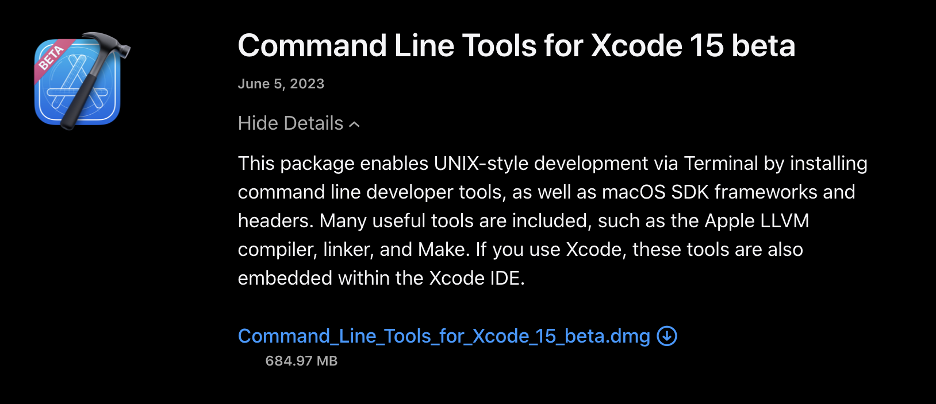

# Unofficail Guidelines for manual installation of packages required to run FATES and CLMT in MacOSX Sonoma

To install the necessary components, we initially require three packages: CMake, Make (often referred to as gmake), and Wget. While CMake and Make could potentially be installed from source, it is unnecessary to do so, as they are not directly interconnected with the packages required by CTSM and FATES. The packages essential for CTSM and FATES can also be installed using Homebrew. However, a potential concern arises when utilizing Homebrew, as it has a tendency to upgrade all packages, potentially causing disruptions in dependencies. For this reason, it is imperative to install the CTSM and FATES required packages from source. This approach ensures consistent compatibility, irrespective of Homebrew's actions. Building from source affords greater control over the build process, allowing for customization of compile-time options to align with specific requirements. Such control proves to be highly valuable for optimizing performance, enabling desired features, or adapting the software to individual needs. Additionally, Wget, a command-line utility, is being installed to facilitate downloading files from the internet during the installation process.

## Before installing the required packages
Before we proceed, we will create a folder called "opt" in the home directory. In this folder, we will store all downloaded packages that will be installed from source.

●	Change directory to the user's home directory

```bash
cd ~
````

●	Create a new directory called 'opt'
```bash
mkdir opt
````

## Command Line Tools
NOTE: Sonoma provides new command line tools (version 15.3 as of May 2024) that cause various issues. This new version of the command line tools does not allow compiling GCC and other packages from source. Therefore, I am installing the beta version 15, which is the immediate release after command line tools for Xcode 14.3.1, which runs perfectly. I cannot install version 14.3.1 because Sonoma does not support it. The version 15 Beta allows the compilation of packages. You need to download the beta 15 version. A screenshot of the software is below. Download the file to ~/opt. There is a compressed folder with Xcode 15 beta in ~.

https://developer.apple.com/download/all/



## Install homebrew
Homebrew is particularly useful for software developers, system administrators, and users who want to customize their development environment, install specific versions of software, or maintain up-to-date tools and utilities. It can be used to install programming languages, libraries, databases, system utilities, and other software components that are not provided by the operating system's package manager.

To install homebrew, check https://brew.sh/

## Install cmake, make, wget, and subversion
***CMake*** simplifies the build process by generating platform-specific build scripts from a high-level configuration file.

***Make*** automates the build process based on instructions defined in a Makefile, managing source files, dependencies, and build targets.

***Wget*** is a tool for downloading files from the internet, often used to fetch resources needed for software development or build processes.

Subversion (SVN) is a version control system used to track changes in source code and other files.

●	Install the required packages via Homebrew

```bash
brew install make cmake wget 
````

subversion
●	To use the installed ***gmake*** instead of the default ***make***, we need to add the following line to the PATH:

```bash
echo 'export PATH=/usr/local/opt/make/libexec/gnubin:$PATH' >> ~/.zshrc
````

●	Then, we need to reload the .zshrc file.

```bash
source ~/.zshrc
````

## GCC

GCC, which stands for the GNU Compiler Collection, is a suite of compilers and related tools that are used to compile and build software programs written in various programming languages. It is one of the most widely used and well-known compiler toolchains in the software development community. GCC is developed by the Free Software Foundation (FSF) and is distributed under the GNU General Public License (GPL).

While Clang is the default compiler provided by Apple and is widely used, some developers and projects still prefer GCC for certain reasons. Here are a few reasons why some people might prefer GCC over Clang when building apps on a Mac:

**Compatibility and Porting:** Some projects might have been developed or tested extensively with GCC on other platforms, and using GCC on a Mac ensures compatibility and easier porting of code between different operating systems.

**Legacy Codebases:** Older codebases or projects that were initially developed with GCC might continue to use it for maintaining consistency and avoiding potential issues that could arise from switching compilers.

**Specific Compiler Features:** GCC provides a wide array of optimization options, language extensions, and compatibility flags. If a project relies on specific GCC features or optimizations that are not easily achievable with Clang, developers might choose to stick with GCC.

**Fortran and Other Languages:** GCC supports languages beyond C and C++, such as Fortran and Ada. If a project involves these languages, GCC might be the preferred choice.

**Ecosystem and Build Scripts:** Some development environments, build scripts, or tools might be set up to work specifically with GCC. Transitioning to Clang could require adjustments to these configurations, which might be undesirable for certain projects.

**Community and Documentation:** For some developers, the available documentation, tutorials, and community support for GCC might be more familiar or suitable for their needs.

●	Navigate into the newly created 'opt' directory
```bash
cd ~/opt
````
●	Create a new directory called 'gcc' and navigate into it
```bash
mkdir gcc
cd gcc
````
●	Download the GCC (GNU Compiler Collection) version 13.2.0 source code archive
```bash
wget https://mirrors.kernel.org/gnu/gcc/gcc-13.2.0/gcc-13.2.0.tar.xz
````
●	Extract the downloaded source code archive
```bash
tar -zxvf gcc-13.2.0.tar.xz
````
●	Navigate into the extracted GCC source code directory
```bash
cd gcc-13.2.0
````
●	Download additional prerequisites required for building GCC
```bash
contrib/download_prerequisites
````
●	Create a new directory called 'build' and navigate into it
```bash
mkdir build && cd build
````
●	Configure the GCC build with specified options:
- Install GCC in /usr/local/gcc-13 directory
- Enable release-level checking
- Enable compilation of C, C++, and Fortran languages
- Disable building multilib (32-bit and 64-bit) support
- Use the specified system root directory for headers and libraries
- Append '-13' to program names to distinguish them from the system's default GCC

```bash
../configure --prefix=/usr/local/gcc-13 \
--enable-checking=release \
--enable-languages=c,c++,fortran \
--disable-multilib \
--with-sysroot=/Library/Developer/CommandLineTools/SDKs/MacOSX.sdk \
--program-suffix=-13
````

●	Build GCC using multiple CPU cores (specified by -j 8)
```bash
make -j 8
````
●	Install GCC and strip unnecessary symbols to reduce binary size
```bash
sudo make install-strip
````
●	Append the GCC bin directory to the user's shell PATH in the .zshrc file
```bash
echo 'export PATH=/usr/local/gcc-13/bin:$PATH' >> ~/.zshrc
````
●	Reload the updated .zshrc file to apply the new PATH configuration
```bash
source ~/.zshrc
````
●	Create symbolic links to the GCC executables with simplified names as ln -s /path/to/original /path/to/link
```bash
ln -s /usr/local/gcc-13/bin/gcc-13 /usr/local/bin/gcc
ln -s /usr/local/gcc-13/bin/g++-13 /usr/local/bin/g++
ln -s /usr/local/gcc-13/bin/gfortran-13 /usr/local/bin/gfortran
````

## MPICH

MPICH is an implementation of the Message Passing Interface (MPI), a standardized and widely used programming model for developing parallel and distributed computing applications. MPI is specifically designed for building applications that run on multiple processors or compute nodes, enabling efficient communication and coordination between these processes. MPICH provides the infrastructure and runtime support needed to create and manage parallel programs that can be executed on clusters, supercomputers, and other distributed computing environments.

```bash
curl -L -O https://www.mpich.org/static/downloads/4.1.2/mpich-4.1.2.tar.gz
````

Note: When I’m working with the wifi off, mpich does not really work on my computer. It is a weird behaviour and I do not the reason.

●	Change directory to the user's 'opt' directory
```bash
cd ~/opt
````
●	Create a new directory called 'mpich'
```bash
mkdir mpich
````
●	Navigate into the newly created 'mpich' directory
```bash
cd mpich
````
●	Download the MPICH version 4.1.2 source code archive using curl
```bash
wget https://www.mpich.org/static/downloads/4.1.2/mpich-4.1.2.tar.gz
````
●	Extract the downloaded MPICH source code archive
```bash
tar -zxvf mpich-4.1.2.tar.gz
````
●	Navigate into the extracted MPICH source code directory
```bash
cd mpich-4.1.2
````
●	Configure the MPICH build with specified options:
-	Install MPICH in /usr/local/mpich-4.1.2 directory
-	Use specific GCC compiler versions for C, C++, and Fortran
```bash
./configure --prefix=/usr/local/mpich \
CC=/usr/local/gcc-13/bin/gcc-13 \
CXX=/usr/local/gcc-13/bin/g++-13 \
FC=/usr/local/gcc-13/bin/gfortran-13 \
FC77=/usr/local/gcc-13/bin/gfortran-13
````
●	Build MPICH using multiple CPU cores (specified by -j 8)
```bash
make -j 8
````
●	Install MPICH
```bash
sudo make install
````
●	Append the MPICH bin directory to the user's shell PATH in the .zshrc file
```bash
echo 'export PATH=/usr/local/mpich/bin:$PATH' >> ~/.zshrc
````
●	Reload the updated .zshrc file to apply the new PATH configuration
```bash
source ~/.zshrc
````

## TESTS

Here we need to verify whether the installations of GCC and MPICH were successful. Several files are located in the folder "testing". I did not author these testing files; I'll provide the links when I remember where I got them from. These files will help us determine the success of the installations. If the exercises fail, it indicates an incorrect installation, requiring us to repeat the process. To execute the files, open each script and run the last two lines that are commented.

## EXPAT
Expat is an XML parsing library that provides a set of functions and tools for reading, interpreting, and manipulating XML (eXtensible Markup Language) documents. XML is a widely used markup language for structuring and representing data in a human-readable and machine-readable format. Expat allows software applications to efficiently parse and process XML data, making it an essential component for various programming tasks involving XML.

●	Change directory to the user's 'opt' directory
```bash
cd ~/opt
````
●	Create a new directory called 'expat'
```bash
mkdir expat
````
●	Navigate into the newly created 'expat' directory
```bash
cd expat
````
●	Download the Expat version 2.5.0 source code archive using wget
```bash
wget https://github.com/libexpat/libexpat/releases/download/R_2_5_0/expat-2.5.0.tar.bz2
````
●	Extract the downloaded Expat source code archive
```bash
tar -zxvf expat-2.5.0.tar.bz2
````
●	Navigate into the extracted Expat source code directory
```bash
cd expat-2.5.0
````
●	Configure the Expat build using default options
```bash
./configure
````
●	Build Expat using multiple CPU cores (specified by -j 8)
```bash
make -j 8
````
●	Install Expat
```bash
sudo make install
````

## ZLIB
ZLIB is a widely used software library for data compression. It provides a set of functions and algorithms for compressing and decompressing data, which is useful for reducing the size of files or data streams for storage or transmission. ZLIB is commonly used in a variety of applications, including file formats like gzip and PNG, network protocols, and software distributions. It employs the Deflate compression algorithm, which combines LZ77 compression and Huffman coding.

Installing libraries like zlib before installing HDF5 (Hierarchical Data Format) and NetCDF (Network Common Data Form) is important because these libraries are often dependencies of HDF5 and NetCDF.

Check latest version here:
https://www.zlib.net/

●	Navigate to the home directory and create a folder named "zlib" to work in.
```bash
cd ~/opt
mkdir zlib
cd zlib
````
●	Download the ZLIB source code archive from the specified URL.
```bash
wget http://www.zlib.net/zlib-1.3.1.tar.gz
````
●	Extract and navigate to the downloaded archive.
```bash
tar -zxvf zlib-1.3.1.tar.gz
cd zlib-1.3.1
````
●	Configure the build process, specifying the installation prefix. This sets the destination directory for the installed files.
```bash
./configure --prefix=/usr/local/hdf5_zlib
````
●	Compile the code and run the tests, making use of multiple CPU cores (-j 8).
```bash
sudo make -j 8 check install
````

## HDF5
HDF5 (Hierarchical Data Format version 5) is a versatile and flexible file format and library designed for managing and storing large and complex datasets. It is widely used in scientific computing, data analysis, and research environments to handle structured and unstructured data, as well as metadata. HDF5 provides features for data organization, compression, parallel I/O, and portability across different platforms and programming languages. It is especially popular in fields such as astronomy, climate modeling, and other scientific domains where efficient data storage, access, and sharing are essential.

●	Navigate to the home directory and create a folder named "hdf5" to work in.
```bash
cd ~/opt
mkdir hdf5
cd hdf5
````
●	Download the HDF5 source code archive from the specified URL.
```bash
wget https://support.hdfgroup.org/ftp/HDF5/releases/hdf5-1.14/hdf5-1.14.1/src/hdf5-1.14.1-2.tar.gz
````
●	Extract and navigate to the downloaded archive.
```bash
tar -zxvf hdf5-1.14.1-2.tar.gz
cd hdf5-1.14.1-2
````
●	Configure the build process, specifying the zlib installation directory and installation prefix. Enabling Fortran and parallel features, and using the mpicc compiler for parallel support.
```bash
./configure --with-zlib=/usr/local/hdf5_zlib \
--prefix=/usr/local/hdf5_zlib \
--enable-fortran \
--enable-parallel \
CC=mpicc
````
●	Compile the code and run tests using multiple CPU cores (-j 8).
```bash
sudo make -j 8 check install
````
●	Add HDF5 binaries to the PATH environment variable.
```bash
echo 'export PATH=/usr/local/hdf5_zlib/bin:$PATH' >> ~/.zshrc
source ~/.zshrc
````

### NETCDF-C
NetCDF (Network Common Data Form) is a set of software libraries and data formats designed for storing, accessing, and sharing scientific data. It provides a standardized way to represent and organize various types of data, making it particularly well-suited for applications in the fields of atmospheric, oceanic, and climate sciences, as well as other scientific domains.

●	Navigate to the home directory and create a folder named "netcdf-c" to work in.
```bash
cd ~/opt
mkdir netcdf-c
cd netcdf-c
````
●	Download the NetCDF-C source code archive from the provided URL.
```bash
wget https://downloads.unidata.ucar.edu/netcdf-c/4.9.2/netcdf-c-4.9.2.tar.gz
````
●	Extract the downloaded archive.
```bash
tar -zxvf netcdf-c-4.9.2.tar.gz
````
●	Move into the extracted directory.
```bash
cd netcdf-c-4.9.2
````
●	Set compiler and linker flags for HDF5 and zlib libraries. Configure the build process, specifying installation prefix and enabling parallel tests.
```bash
./configure \
CPPFLAGS=-I/usr/local/hdf5_zlib/include \
LDFLAGS=-L/usr/local/hdf5_zlib/lib \
--prefix=/usr/local/netcdf \
--enable-parallel-tests \
CC=mpicc
````
●	Compile the code and run tests using multiple CPU cores (-j 8).
```bash
sudo make -j 8 check install
````
●	Add NetCDF binaries to the PATH environment variable.
```bash
echo 'export PATH=/usr/local/netcdf/bin:$PATH' >> ~/.zshrc
source ~/.zshrc
````
●	Check NetCDF configuration using nc-config.
```bash
nc-config --all
````

## NETCDF-FORTRAN
NetCDF-Fortran is a component of the NetCDF software suite that provides Fortran language bindings for working with NetCDF data files. Fortran is a programming language commonly used in scientific and engineering applications, and NetCDF-Fortran allows Fortran programs to read from and write to NetCDF files seamlessly. It extends the capabilities of the core NetCDF library by enabling Fortran-specific data manipulation and access.

●	Navigate to the home directory and create a folder named "netcdf-fortran" to work in.
```bash
cd ~/opt
mkdir netcdf-fortran
cd netcdf-fortran
````
●	Download the NetCDF-Fortran source code archive from the provided URL.
```bash
wget https://downloads.unidata.ucar.edu/netcdf-fortran/4.6.1/netcdf-fortran-4.6.1.tar.gz
````
●	Extract the downloaded archive.
```bash
tar -zxvf netcdf-fortran-4.6.1.tar.gz
cd netcdf-fortran-4.6.1
````
●	Set the Fortran compiler, compiler flags, and linker flags for NetCDF library. Configure the build process, specifying installation prefix and enabling parallel tests.
```bash
./configure \
CPPFLAGS=-I/usr/local/netcdf/include \
LDFLAGS=-L/usr/local/netcdf/lib \
--prefix=/usr/local/netcdf \
--enable-parallel-tests \
FC=mpif90
````
●	Compile the code and run tests using multiple CPU cores (-j 8).
```bash
make -j 8
sudo make install
````
●	Check NetCDF configuration using nc-config.
```bash
make check
nf-config –all
````

## ESMF
ESMF stands for Earth System Modeling Framework. It is an open-source software framework developed for building and coupling complex Earth system models. ESMF provides a set of tools and libraries that facilitate the development, execution, and coupling of models that simulate different components of the Earth system, such as the atmosphere, ocean, land surface, and more. It is widely used in climate and weather research, as well as other Earth science disciplines.

●	Create a folder named "esmf" in the home directory
```bash
cd ~/
mkdir esmf
cd esmf
````
●	Download the latest version of ESMF (v8.6.1) from GitHub
```bash
wget https://github.com/esmf-org/esmf/archive/refs/tags/v8.6.1.tar.gz
````
●	Extract the downloaded tarball
```bash
tar -zxvf v8.6.1.tar.gz
````
●	Navigate to the extracted ESMF directory
```bash
cd esmf-8.6.1 
````
●	Set environment variables required for ESMF configuration
```bash
export ESMF_DIR=/Users/MedinaJA/esmf/esmf-8.6.1
export ESMF_COMPILER=gfortran
export ESMF_COMM=mpich
export ESMF_NETCDF=nc-config
export ESMF_NETCDF_INCLUDE=/usr/local/netcdf/include
export ESMF_NETCDF_LIBPATH=/usr/local/netcdf/lib
export ESMF_NETCDF_LIBS='-lnetcdff -lnetcdf'
````
●	Compile ESMF using the "make" command with parallel processing (-j8 for 8 parallel jobs)
```bash
gmake -j8
````
●	Install ESMF
```bash
gmake install
````

Notes: 
●	The key file is installed in:
```bash
/Users/XXX/esmf/esmf-8.6.1/lib/libO/Darwin.gfortran.64.mpich.default
````
●	The key file path is:
```bash
/Users/XXX/esmf/esmf-8.6.1/lib/libO/Darwin.gfortran.64.mpich.default/esmf.mk
````
●	The environmental variable for the config.machine is:

```bash
   <environment_variables comp_interface="nuopc">
      <env name="ESMFMKFILE">/Users/XXX/esmf/esmf-8.6.1/lib/libO/Darwin.gfortran.64.mpich.default/esmf.mk</env>
    </environment_variables>
````